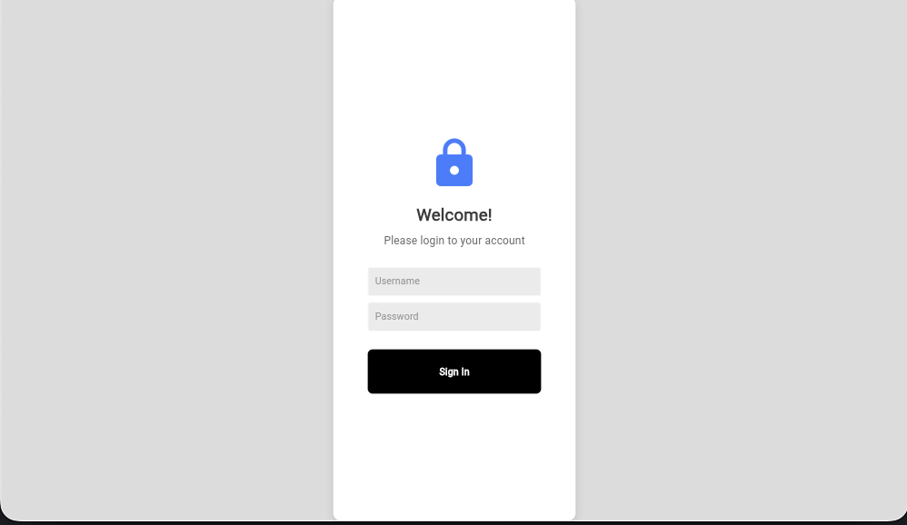
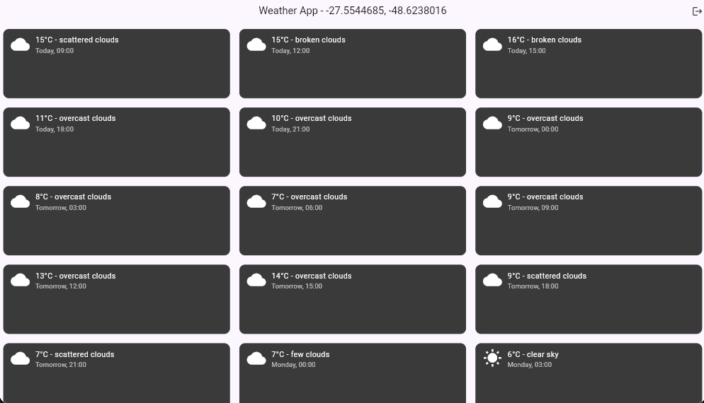
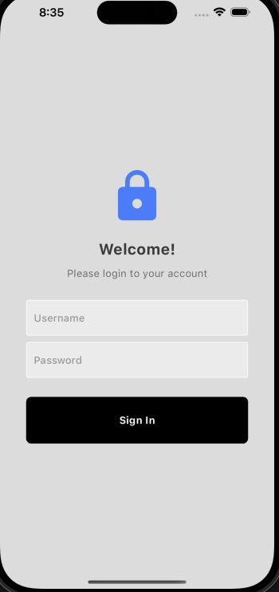
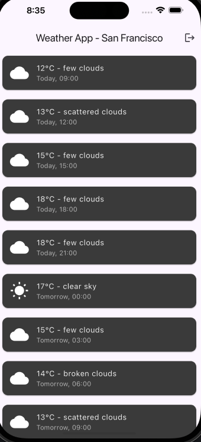

# weather app

* A new Flutter project to consult a weather api and provide its informations.

* There are two pages, Login and Home.

## Getting Started

This project is a starting point for a Flutter application.

- Clone this project;
- To execute `flutter run`
- To login: user: admin pass: admin

This project is adapted to run on Web, mobile web and mobile IOS.

## Images

### Web

### IOS

